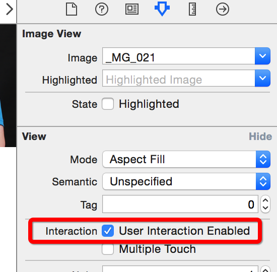
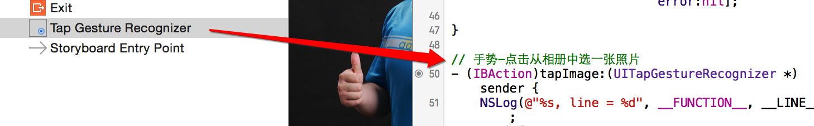
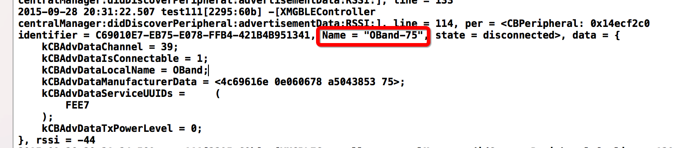

# HJBluetoothDemo
集合了GameKit和BLE蓝牙技术教程和Demo


# GameKit用法

## 一.准备工作
- 1.搭建UI


- 2.拖线

```objc
// 图片
@property (weak, nonatomic) IBOutlet UIImageView *imageView;

// 建立连接
- (IBAction)buildConnect:(id)sender{}

// 发送数据
- (IBAction)sendData:(id)sender{}
```
## 二.连接蓝牙

- 显示可以连接的蓝牙设备列表

```objc
- (IBAction)buildConnect:(id)sender {
    // 创建弹窗
    GKPeerPickerController *ppc = [[GKPeerPickerController alloc] init];
    // 设置代理  @interface ViewController () <GKPeerPickerControllerDelegate>
    ppc.delegate = self;
    // 展示
    [ppc show];
}
```
- 监听蓝牙的连接

```objc
#pragma mark -GKPeerPickerControllerDelegate
// 连接成功就会调用
- (void)peerPickerController:(GKPeerPickerController *)picker // 弹窗
              didConnectPeer:(NSString *)peerID // 连接到的蓝牙设备号
                   toSession:(GKSession *)session // 连接会话(通过它进行数据交互)
{
    NSLog(@"%s, line = %d", __FUNCTION__, __LINE__);
    // 弹窗消失
    [picker dismiss];
}
```

## 三.利用蓝牙传输数据

- 点击图片从相册中选择一张显示本机
    * 可以修改imaV为Btn,也可以为imaV添加手势
        * 1.修改imageView的用户交互
    
        * 2.添加手势到图片上
    
        * 3.拖出手势的响应事件
    
        * 4.完善相册选择图片代码

```objc
    // 手势-点击从相册中选一张照片
- (IBAction)tapImage:(UITapGestureRecognizer *)sender {
    NSLog(@"%s, line = %d", __FUNCTION__, __LINE__);
    // 先判断是否有相册
    if (![UIImagePickerController isSourceTypeAvailable:UIImagePickerControllerSourceTypePhotoLibrary]) {
        return;
    }
    // 创建弹出的控制器
    UIImagePickerController *ipc = [[UIImagePickerController alloc] init];
    // 设置图片来源为相册
    ipc.sourceType = UIImagePickerControllerSourceTypePhotoLibrary;
    // 设置代理 @interface ViewController () <UINavigationControllerDelegate, UIImagePickerControllerDelegate>
    ipc.delegate = self;
    // modal出来
    [self presentViewController:ipc animated:YES completion:nil];
}
#pragma mark - UINavigationControllerDelegate, UIImagePickerControllerDelegate
// 选中某图片后调用
- (void)imagePickerController:(UIImagePickerController *)picker didFinishPickingMediaWithInfo:(NSDictionary<NSString *,id> *)info
{
    // 控制器返回
    [picker dismissViewControllerAnimated:YES completion:nil];
    // 设置图片
    self.imageView.image = info[UIImagePickerControllerOriginalImage];
}
```

- 点击发送数据完成图片显示到另一个蓝牙机器上
    * 1.分析需要通过GKSession对象来传递数据,所以在`peerPickerController:didConnectPeer:didConnectPeer:`的方法中保存session会话

```objc
@property (nonatomic, strong) GKSession *session; /**< 蓝牙连接会话 */

// 连接成功就会调用
- (void)peerPickerController:(GKPeerPickerController *)picker // 弹窗
              didConnectPeer:(NSString *)peerID // 连接到的蓝牙设备号
                   toSession:(GKSession *)session // 连接会话(通过它进行数据交互)
{
    NSLog(@"%s, line = %d", __FUNCTION__, __LINE__);
    // 弹窗消失
    [picker dismiss];
    // 保存会话
    self.session = session;
}
```
- 发送

```objc
// 发送数据
- (IBAction)sendData:(id)sender {
    if (self.imageView.image == nil) return; // 有图片才继续执行
    // 通过蓝牙链接会话发送数据到所有设备
    [self.session sendDataToAllPeers:UIImagePNGRepresentation(self.imageView.image) // 数据
                        withDataMode:GKSendDataReliable // 枚举:发完为止
                               error:nil];

}
```

- 接收

```objc
// 连接成功就会调用
- (void)peerPickerController:(GKPeerPickerController *)picker // 弹窗
              didConnectPeer:(NSString *)peerID // 连接到的蓝牙设备号
                   toSession:(GKSession *)session // 连接会话(通过它进行数据交互)
{
    NSLog(@"%s, line = %d", __FUNCTION__, __LINE__);
    // 弹窗消失
    [picker dismiss];
    // 保存会话
    self.session = session;
    // 处理接收到的数据[蓝牙设备接收到数据时,就会调用 [self receiveData:fromPeer:inSession:context:]]
    // 设置数据接受者为:self
    [self.session setDataReceiveHandler:self
                       withContext:nil];
}
#pragma mark - 蓝牙设备接收到数据时,就会调用
- (void)receiveData:(NSData *)data // 数据
           fromPeer:(NSString *)peer // 来自哪个设备
          inSession:(GKSession *)session // 连接会话
            context:(void *)context
{
    NSLog(@"%s, line = %d", __FUNCTION__, __LINE__);
    // 显示
    self.imageView.image = [UIImage imageWithData:data];
    // 写入相册
    UIImageWriteToSavedPhotosAlbum(self.imageView.image, nil, nil, nil);
}


```

## 四.注意

- 只能用于iOS设备之间的链接
- 只能用于同一个应用程序之间的连接
- 最好别利用蓝牙发送比较大的数据


# BLE中心模式流程-coding
## BLE中心模式流程
- 1.建立中心角色
- 2.扫描外设(Discover Peripheral)
- 3.连接外设(Connect Peripheral)
- 4.扫描外设中的服务和特征(Discover Services And Characteristics)
    * 4.1 获取外设的services
    * 4.2 获取外设的Characteristics,获取characteristics的值,,获取Characteristics的Descriptor和Descriptor的值
- 5.利用特征与外设做数据交互(Explore And Interact)
- 6.订阅Characteristic的通知
- 7.断开连接(Disconnect)

## 准备环境

- 1.Xcode7.0
- 2.手机
- 3.外设(手机+LightBlue)

## 实现步骤
#### 1.导入CB头文件,建立主设备管理类,设置主设备代理

```objc
#import <CoreBluetooth/CoreBluetooth.h>
@interface XMGBLEController () <CBCentralManagerDelegate>
@property (nonatomic, strong) CBCentralManager *cMgr; /**< 中心管理设备 */
@end
@implementation XMGBLEController
#pragma mark - 懒加载
// 1.建立中心管理者
- (CBCentralManager *)cMgr
{
    if (!_cMgr) {
        NSLog(@"%s, line = %d", __FUNCTION__, __LINE__);
        /*
         设置主设备的代理,CBCentralManagerDelegate
         必须实现的：
         - (void)centralManagerDidUpdateState:(CBCentralManager *)central;//主设备状态改变调用，在初始化CBCentralManager的适合会打开设备，只有当设备正确打开后才能使用
         其他选择实现的委托中比较重要的：
         - (void)centralManager:(CBCentralManager *)central didDiscoverPeripheral:(CBPeripheral *)peripheral advertisementData:(NSDictionary *)advertisementData RSSI:(NSNumber *)RSSI; //找到外设
         - (void)centralManager:(CBCentralManager *)central didConnectPeripheral:(CBPeripheral *)peripheral;//连接外设成功
         - (void)centralManager:(CBCentralManager *)central didFailToConnectPeripheral:(CBPeripheral *)peripheral error:(NSError *)error;//外设连接失败
         - (void)centralManager:(CBCentralManager *)central didDisconnectPeripheral:(CBPeripheral *)peripheral error:(NSError *)error;//断开外设
         */
        _cMgr = [[CBCentralManager alloc] initWithDelegate:self queue:dispatch_get_main_queue()]; // 线程不传默认是主线程
    }
    return _cMgr;
}
- (void)viewDidLoad {
    [super viewDidLoad];
    self.title = @"BLE";
    self.view.backgroundColor = [UIColor orangeColor];
    // 初始化
    [self cMgr];
    // 不能在此处扫描,因为状态还没变为打开
    //[self.cMgr scanForPeripheralsWithServices:nil options:nil];
}
```
#### 2.扫描外设

- 扫描的方法防治cMgr成功打开的代理方法中
- 只有设备成功打开,才能开始扫描,否则会报错

```objc
#pragma mark - CBCentralManagerDelegate
// 中心管理者状态改变, 在初始化CBCentralManager的时候会打开设备，只有当设备正确打开后才能使用
- (void)centralManagerDidUpdateState:(CBCentralManager *)central
{
    NSLog(@"%s, line = %d", __FUNCTION__, __LINE__);
    switch (central.state) {
        case CBCentralManagerStateUnknown:
            NSLog(@">>>CBCentralManagerStateUnknown");
            break;
        case CBCentralManagerStateResetting:
            NSLog(@">>>CBCentralManagerStateResetting");
            break;
        case CBCentralManagerStateUnsupported:
            NSLog(@">>>CBCentralManagerStateUnsupported");
            break;
        case CBCentralManagerStateUnauthorized:
            NSLog(@">>>CBCentralManagerStateUnauthorized");
            break;
        case CBCentralManagerStatePoweredOff:
            NSLog(@">>>CBCentralManagerStatePoweredOff");
            break;
        case CBCentralManagerStatePoweredOn:
            NSLog(@">>>CBCentralManagerStatePoweredOn");
            // 2.开始扫描周围的外设
            /*
             第一个参数nil就是扫描周围所有的外设，扫描到外设后会进入
             - (void)centralManager:(CBCentralManager *)central didDiscoverPeripheral:(CBPeripheral *)peripheral advertisementData:(NSDictionary *)advertisementData RSSI:(NSNumber *)RSSI;
             */
            [self.cMgr scanForPeripheralsWithServices:nil options:nil];

            break;
        default:
        break;
    }
}
// 扫描到设备会进入到此代理方法
- (void)centralManager:(CBCentralManager *)central didDiscoverPeripheral:(CBPeripheral *)peripheral advertisementData:(NSDictionary<NSString *,id> *)advertisementData RSSI:(NSNumber *)RSSI
{
    NSLog(@"%s, line = %d, per = %@, data = %@, rssi = %@", __FUNCTION__, __LINE__, peripheral, advertisementData, RSSI);
    // 接下来连接设备
}

```


#### 3.连接外设
- 扫描手环,打印结果

- 根据打印结果

```objc
// 扫描到设备会进入到此代理方法
- (void)centralManager:(CBCentralManager *)central didDiscoverPeripheral:(CBPeripheral *)peripheral advertisementData:(NSDictionary<NSString *,id> *)advertisementData RSSI:(NSNumber *)RSSI
{
    NSLog(@"%s, line = %d, per = %@, data = %@, rssi = %@", __FUNCTION__, __LINE__, peripheral, advertisementData, RSSI);

    // 3.接下来可以连接设备
    //如果你没有设备，可以下载一个app叫lightbule的app去模拟一个设备
    //这里自己去设置下连接规则，我设置的是二维码扫描到的运动手环的设备号
    // 判断设备号是否扫描到
    if ([peripheral.name isEqualToString:@"OBand-75"]) {
        /*
         一个主设备最多能连7个外设，每个外设最多只能给一个主设备连接,连接成功，失败，断开会进入各自的委托
         - (void)centralManager:(CBCentralManager *)central didConnectPeripheral:(CBPeripheral *)peripheral;//连接外设成功的委托
         - (void)centralManager:(CBCentralManager *)central didFailToConnectPeripheral:(CBPeripheral *)peripheral error:(NSError *)error;//外设连接失败的委托
         - (void)centralManager:(CBCentralManager *)central didDisconnectPeripheral:(CBPeripheral *)peripheral error:(NSError *)error;//断开外设的委托
         */
        // 保存外设,否则方法结束就销毁
        self.per = peripheral;
        [self.cMgr connectPeripheral:self.per options:nil];
    }else
    {
        // 此处Alert提示未扫描到设备,重新扫描
#warning noCode
        NSLog(@"没扫描到 >>>>>>>>  %s, line = %d", __FUNCTION__, __LINE__);
    }
}
// 外设连接成功
- (void)centralManager:(CBCentralManager *)central didConnectPeripheral:(CBPeripheral *)peripheral
{
    NSLog(@"%s, line = %d", __FUNCTION__, __LINE__);
    NSLog(@">>>连接到名称为（%@）的设备-成功",peripheral.name);
}
// 外设连接失败
- (void)centralManager:(CBCentralManager *)central didFailToConnectPeripheral:(CBPeripheral *)peripheral error:(NSError *)error
{
    NSLog(@"%s, line = %d", __FUNCTION__, __LINE__);
}
// 断开连接(丢失连接)
- (void)centralManager:(CBCentralManager *)central didDisconnectPeripheral:(CBPeripheral *)peripheral error:(NSError *)error
{
    NSLog(@"%s, line = %d", __FUNCTION__, __LINE__);
}
```

#### 4.扫描外设中的服务和特征

```objc
  设备链接成功后,就可以扫描设备的服务(services)了,同样是通过代理,扫描到结果后会触发某代理方法.
  注意:此时CBCentralManagerDelegate已经不能满足需求,需要新的CBPeripheralDelegate来搞定.
  该协议中包含了central与peripheral的许多回调方法
  (eg.:获取services,获取characteristics,获取characteristics的值,获取characteristics的Descriptor以及Descriptor的值,写数据,读RSSI,用通知的方式订阅数据等等).

```
- 4.1 获取外设的services
    * 首先设置外设的代理,并搜寻services
    * 然后在代理方法`peripheral:didDiscoverServices:`中遍历services

```objc
// 外设连接成功
- (void)centralManager:(CBCentralManager *)central didConnectPeripheral:(CBPeripheral *)peripheral
{
    NSLog(@"%s, line = %d", __FUNCTION__, __LINE__);
    NSLog(@">>>连接到名称为（%@）的设备-成功",peripheral.name);
    //设置的peripheral代理CBPeripheralDelegate
    //@interface ViewController : UIViewController<CBCentralManagerDelegate,CBPeripheralDelegate>
    [peripheral setDelegate:self];

    //扫描外设Services，成功后会进入方法：-(void)peripheral:(CBPeripheral *)peripheral didDiscoverServices:(NSError *)error{
    [peripheral discoverServices:nil];
    /*
     Discovers the specified services of the peripheral.
     An array of CBUUID objects that you are interested in. Here, each CBUUID object represents a UUID that identifies the type of service you want to discover.
     */
}

#pragma mark - CBPeripheralDelegate
// 发现外设的service
- (void)peripheral:(CBPeripheral *)peripheral didDiscoverServices:(NSError *)error
{
    if (error)
    {
        NSLog(@">>>Discovered services for %@ with error: %@", peripheral.name, [error localizedDescription]);
        return;
    }

    for (CBService *service in peripheral.services) {
        NSLog(@"service.UUID = %@", service.UUID);
        //扫描每个service的Characteristics，扫描到后会进入方法： -(void)peripheral:(CBPeripheral *)peripheral didDiscoverCharacteristicsForService:(CBService *)service error:(NSError *)error
        [peripheral discoverCharacteristics:nil forService:service];
    }
}
```
- 4.2 获取外设的characteris,获取Characteristics的值,获取Characteristics的Descriptor以及Descriptor的值

```objc
// 外设发现service的特征
- (void)peripheral:(CBPeripheral *)peripheral didDiscoverCharacteristicsForService:(CBService *)service error:(NSError *)error
{
    if (error)
    {
        NSLog(@"error Discovered characteristics for %@ with error: %@", service.UUID, [error localizedDescription]);
        return;
    }
    for (CBCharacteristic *characteristic in service.characteristics)
    {
        NSLog(@"service:%@ 的 Characteristic: %@",service.UUID,characteristic.UUID);
    }

#warning noCodeFor 优化,分开写是为了让大家看注释清晰,并不符合编码规范
    //获取Characteristic的值，读到数据会进入方法：-(void)peripheral:(CBPeripheral *)peripheral didUpdateValueForCharacteristic:(CBCharacteristic *)characteristic error:(NSError *)error
    for (CBCharacteristic *characteristic in service.characteristics){
        [peripheral readValueForCharacteristic:characteristic]; // 外设读取特征的值
    }

    //搜索Characteristic的Descriptors，读到数据会进入方法：-(void)peripheral:(CBPeripheral *)peripheral didDiscoverDescriptorsForCharacteristic:(CBCharacteristic *)characteristic error:(NSError *)error
    for (CBCharacteristic *characteristic in service.characteristics){
        [peripheral discoverDescriptorsForCharacteristic:characteristic]; // 外设发现特征的描述
    }
}

// 获取characteristic的值
- (void)peripheral:(CBPeripheral *)peripheral didUpdateValueForCharacteristic:(nonnull CBCharacteristic *)characteristic error:(nullable NSError *)error
{
    //打印出characteristic的UUID和值
    //!注意，value的类型是NSData，具体开发时，会根据外设协议制定的方式去解析数据
    NSLog(@"%s, line = %d, characteristic.UUID:%@  value:%@", __FUNCTION__, __LINE__, characteristic.UUID, characteristic.value);
}
// 获取Characteristics的 descriptor的值
- (void)peripheral:(CBPeripheral *)peripheral didUpdateValueForDescriptor:(nonnull CBDescriptor *)descriptor error:(nullable NSError *)error
{
    //打印出DescriptorsUUID 和value
    //这个descriptor都是对于characteristic的描述，一般都是字符串，所以这里我们转换成字符串去解析
    NSLog(@"%s, line = %d, descriptor.UUID:%@ value:%@", __FUNCTION__, __LINE__, descriptor.UUID, descriptor.value);
}
// 发现特征Characteristics的描述Descriptor
- (void)peripheral:(CBPeripheral *)peripheral didDiscoverDescriptorsForCharacteristic:(nonnull CBCharacteristic *)characteristic error:(nullable NSError *)error
{
    NSLog(@"%s, line = %d", __FUNCTION__, __LINE__);
    for (CBDescriptor *descriptor in characteristic.descriptors) {
        NSLog(@"descriptor.UUID:%@",descriptor.UUID);
    }
}
```

#### 5.写数据到特征中

```objc
// 5.将数据写入特征(自定义方法,为了看的更清楚,没别的意思)
- (void)zhj_peripheral:(CBPeripheral *)peripheral writeData:(NSData *)data forCharacteristic:(CBCharacteristic *)characteristic
{
    /*
    typedef NS_OPTIONS(NSUInteger, CBCharacteristicProperties) {
        CBCharacteristicPropertyBroadcast												= 0x01,
        CBCharacteristicPropertyRead													= 0x02,
        CBCharacteristicPropertyWriteWithoutResponse									= 0x04,
        CBCharacteristicPropertyWrite													= 0x08,
        CBCharacteristicPropertyNotify													= 0x10,
        CBCharacteristicPropertyIndicate												= 0x20,
        CBCharacteristicPropertyAuthenticatedSignedWrites								= 0x40,
        CBCharacteristicPropertyExtendedProperties										= 0x80,
        CBCharacteristicPropertyNotifyEncryptionRequired NS_ENUM_AVAILABLE(NA, 6_0)		= 0x100,
        CBCharacteristicPropertyIndicateEncryptionRequired NS_ENUM_AVAILABLE(NA, 6_0)	= 0x200
    };
     打印出特征的权限(characteristic.properties),可以看到有很多种,这是一个NS_OPTIONS的枚举,可以是多个值
     常见的又read,write,noitfy,indicate.知道这几个基本够用了,前俩是读写权限,后俩都是通知,俩不同的通知方式
     */
    NSLog(@"%s, line = %d, characteristic.properties:%d", __FUNCTION__, __LINE__, characteristic.properties);

    // 只有特征的properties中有写的属性时候,才写
    if (characteristic.properties & CBCharacteristicPropertyWrite) {
        // 这句才是正宗的核心代码
        [peripheral writeValue:data forCharacteristic:characteristic type:CBCharacteristicWriteWithResponse];
    }
}
```
#### 6.订阅特征的通知

```objc
// 设置通知
- (void)zhj_peripheral:(CBPeripheral *)peripheral setNotifzhjorCharacteristic:(CBCharacteristic *)characteristic
{
    // 设置通知, 数据会进入 peripheral:didUpdateValueForCharacteristic:error:方法
    [peripheral setNotifyValue:YES forCharacteristic:characteristic];
}
// 取消通知
- (void)zhj_peripheral:(CBPeripheral *)peripheral cancelNotifzhjorCharacteristic:(CBCharacteristic *)characteristic
{
    [peripheral setNotifyValue:NO forCharacteristic:characteristic];
}
```

#### 7.断开连接

```objc
// 7.断开连接
- (void)zhj_cMgr:(CBCentralManager *)cMgr stopScanAndDisConnectWithPeripheral:(CBPeripheral *)peripheral
{
    // 停止扫描
    [cMgr stopScan];
    // 断开连接
    [cMgr cancelPeripheralConnection:peripheral];
}
```
# BLE-periphral外设模式流程

#### 之前在基础知识介绍过BLE应用的两种流程,如图:


- central模式用的都是左边的类，而peripheral模式用的是右边的类

## peripheral模式的流程

- 1.引入CoreBluetooth框架,初始化peripheralManager
- 2.设置peripheralManager中的内容
- 3.开启广播advertising
- 4.对central的操作进行响应
    - 4.1 读characteristics请求
    - 4.2 写characteristics请求
    - 4.4 订阅和取消订阅characteristics

## 准备环境
- Xcode
- 真机(4s以上)

## 具体操作步骤

#### 1.引入CoreBluetooth框架,初始化peripheralManager

```objc
#import <CoreBluetooth/CoreBluetooth.h>
@interface XMGBLEPeripheralViewController () <CBPeripheralManagerDelegate>
@property (nonatomic, strong) CBPeripheralManager *centerMgr; /**< 外设管理者 */
@end

@implementation XMGBLEPeripheralViewController
// 懒加载
- (CBPeripheralManager *)centerMgr
{
    if (!_centerMgr) {
        _centerMgr = [[CBPeripheralManager alloc] initWithDelegate:self queue:dispatch_get_main_queue()];
    }
    return _centerMgr;
}

- (void)viewDidLoad {
    [super viewDidLoad];
    // 调用get方法初始化,初始化后CBPeripheralManager状态改变会调用代理方法peripheralManagerDidUpdateState:
    // 模拟器永远也不会是CBPeripheralManagerStatePoweredOn状态
    [self centerMgr];
}
```

#### 2.设置peripheralManager中的内容
 - 创建characteristics及其description,
 - 创建service,把characteristics添加到service中,
 - 再把service添加到peripheralManager中

```objc
#pragma mark - CBPeripheralManagerDelegate
// CBPeripheralManager初始化后会触发的方法
- (void)peripheralManagerDidUpdateState:(CBPeripheralManager *)peripheral
{
    if (peripheral.state == CBPeripheralManagerStatePoweredOn) {
        // 提示设备成功打开
        [SVProgressHUD showSuccessWithStatus:@"xmg设备打开成功~"];
        // 配置各种服务入CBPeripheralManager
        [self zhj_setupcenterMgr];
    }else
    {
        // 提示设备打开失败
        [SVProgressHUD showErrorWithStatus:@"失败!"];
    }
}

#pragma mark - 私有方法
- (void)zhj_setupcenterMgr
{
    // 特征描述的UUID
    CBUUID *characteristicUserDescriptionUUID = [CBUUID UUIDWithString:CBUUIDCharacteristicUserDescriptionString];
    // 特征的通知UUID
    CBUUID *notifyCharacteristicUUID = [CBUUID UUIDWithString:notiyCharacteristicStrUUID];
    // 特征的读写UUID
    CBUUID *readwriteCharacteristicUUID = [CBUUID UUIDWithString:readwriteCharacteristicStrUUID];
    // 特征的只读UUID
    CBUUID *readCharacteristicUUID = [CBUUID UUIDWithString:readwriteCharacteristicStrUUID];
    CBUUID *ser1UUID = [CBUUID UUIDWithString:Service1StrUUID];
    CBUUID *ser2UUID = [CBUUID UUIDWithString:Service2StrUUID];


    // 初始化一个特征的描述
    CBMutableDescriptor *des1 = [[CBMutableDescriptor alloc] initWithType:characteristicUserDescriptionUUID value:@"xmgDes1"];

    // 可通知的特征
    CBMutableCharacteristic *notifyCharacteristic = [[CBMutableCharacteristic alloc] initWithType:notifyCharacteristicUUID // UUID
                                                                                       properties:CBCharacteristicPropertyNotify // 枚举:通知
                                                                                            value:nil // 数据先不传
                                                                                      permissions:CBAttributePermissionsReadable]; // 枚举:可读
    // 可读写的特征
    CBMutableCharacteristic *readwriteChar = [[CBMutableCharacteristic alloc] initWithType:readwriteCharacteristicUUID
                                                                                properties:CBCharacteristicPropertyRead | CBCharacteristicPropertyWrite
                                                                                     value:nil
                                                                               permissions:CBAttributePermissionsReadable | CBAttributePermissionsWriteable];
    [readwriteChar setDescriptors:@[des1]]; // 设置特征的描述

    // 只读特征
    CBMutableCharacteristic *readChar = [[CBMutableCharacteristic alloc] initWithType:readCharacteristicUUID
                                                                           properties:CBCharacteristicPropertyRead
                                                                                value:nil
                                                                          permissions:CBAttributePermissionsReadable];

    // 初始化服务1
    CBMutableService *ser1 = [[CBMutableService alloc] initWithType:ser1UUID primary:YES];
    // 为服务设置俩特征(通知, 带描述的读写)
    [ser1 setCharacteristics:@[notifyCharacteristic, readwriteChar]];

    // 初始化服务2,并且添加一个只读特征
    CBMutableService *ser2 = [[CBMutableService alloc] initWithType:ser2UUID primary:YES];
    ser2.characteristics = @[readChar];

    // 添加服务进外设管理者
    // 添加操作会触发代理方法peripheralManager:didAddService:error:
    [self.centerMgr addService:ser1];
    [self.centerMgr addService:ser2];
}
```

#### 3.开启广播

```objc
// 添加服务进CBPeripheralManager时会触发的方法
- (void)peripheralManager:(CBPeripheralManager *)peripheral didAddService:(CBService *)service error:(NSError *)error
{
    // 由于添加了两次ser,所以方法会调用两次
    static int i = 0;
    if (!error) {
        i++;
    }

    // 当第二次进入方法时候,代表两个服务添加完毕,此时要用到2,由于没有扩展性,所以新增了可变数组,记录添加的服务数量
    if (i == self.servieces.count) {
        // 广播内容
        NSDictionary *advertDict = @{CBAdvertisementDataServiceUUIDsKey: [self.servieces valueForKeyPath:@"UUID"],
                                     CBAdvertisementDataLocalNameKey:LocalNameKey};
        // 发出广播,会触发peripheralManagerDidStartAdvertising:error:
        [peripheral startAdvertising:advertDict];
    }
}
// 开始广播触发的代理
- (void)peripheralManagerDidStartAdvertising:(CBPeripheralManager *)peripheral error:(NSError *)error
{

}

>>>>>>>>分割线>>>>下面是修改的地方

@property (nonatomic, strong) NSMutableArray *servieces; /**< 服务可变数组 */
// 自定义服务
- (NSMutableArray *)servieces
{
    if (!_servieces) {
        _servieces = [NSMutableArray array];
    }
    return _servieces;
}
#pragma mark - 私有方法
- (void)zhj_setupcenterMgr
{
    ...

    // 初始化服务1
    CBMutableService *ser1 = [[CBMutableService alloc] initWithType:ser1UUID primary:YES];
    // 为服务设置俩特征(通知, 带描述的读写)
    [ser1 setCharacteristics:@[notifyCharacteristic, readwriteChar]];
    [self.servieces addObject:ser1];

    // 初始化服务2,并且添加一个只读特征
    CBMutableService *ser2 = [[CBMutableService alloc] initWithType:ser2UUID primary:YES];
    ser2.characteristics = @[readChar];
    [self.servieces addObject:ser2];

    // 添加服务进外设管理者
    // 添加操作会触发代理方法peripheralManager:didAddService:error:
    if (self.servieces.count) {
        for (CBMutableService *ser in self.servieces) {
            [self.centerMgr addService:ser];
        }
    }
}
```

#### 4.对central的操作做出响应
- 4.1 读characteristics请求
- 4.2 写characteristics请求
- 4.3 订阅和取消订阅characteristics

```objc
// 外设收到读的请求,然后读特征的值赋值给request
- (void)peripheralManager:(CBPeripheralManager *)peripheral didReceiveReadRequest:(CBATTRequest *)request
{
    NSLog(@"%s, line = %d", __FUNCTION__, __LINE__);
    // 判断是否可读
    if (request.characteristic.properties & CBCharacteristicPropertyRead) {
        NSData *data = request.characteristic.value;

        request.value = data;
        // 对请求成功做出响应
        [self.centerMgr respondToRequest:request withResult:CBATTErrorSuccess];
    }else
    {
        [self.centerMgr respondToRequest:request withResult:CBATTErrorWriteNotPermitted];
    }
}
// 外设收到写的请求,然后读request的值,写给特征
- (void)peripheralManager:(CBPeripheralManager *)peripheral didReceiveWriteRequests:(NSArray<CBATTRequest *> *)requests
{
    NSLog(@"%s, line = %d, requests = %@", __FUNCTION__, __LINE__, requests);
    CBATTRequest *request = requests.firstObject;
    if (request.characteristic.properties & CBCharacteristicPropertyWrite) {
        NSData *data = request.value;
        // 此处赋值要转类型,否则报错
        CBMutableCharacteristic *mChar = (CBMutableCharacteristic *)request.characteristic;
        mChar.value = data;
        // 对请求成功做出响应
        [self.centerMgr respondToRequest:request withResult:CBATTErrorSuccess];
    }else
    {
        [self.centerMgr respondToRequest:request withResult:CBATTErrorWriteNotPermitted];
    }
}


// 与CBCentral的交互
// 订阅特征
- (void)peripheralManager:(CBPeripheralManager *)peripheral central:(CBCentral *)central didSubscribeToCharacteristic:(CBCharacteristic *)characteristic
{
    NSLog(@"%s, line = %d, 订阅了%@的数据", __FUNCTION__, __LINE__, characteristic.UUID);
    NSTimer *timer = [NSTimer scheduledTimerWithTimeInterval:2.0
                                                      target:self
                                                    selector:@selector(zhj_sendData:)
                                                    userInfo:characteristic
                                                     repeats:YES];

    self.timer = timer;

    /* 另一种方法 */
//    NSTimer *testTimer = [NSTimer timerWithTimeInterval:2.0
//                                                 target:self
//                                               selector:@selector(zhj_sendData:)
//                                               userInfo:characteristic
//                                                repeats:YES];
//    [[NSRunLoop currentRunLoop] addTimer:testTimer forMode:NSDefaultRunLoopMode];

}
// 取消订阅特征
- (void)peripheralManager:(CBPeripheralManager *)peripheral central:(CBCentral *)central didUnsubscribeFromCharacteristic:(CBCharacteristic *)characteristic
{
    NSLog(@"%s, line = %d, 取消订阅了%@的数据", __FUNCTION__, __LINE__, characteristic.UUID);
    [self.timer invalidate];
    self.timer = nil;
}

- (void)peripheralManagerIsReadyToUpdateSubscribers:(CBPeripheralManager *)peripheral
{
    NSLog(@"%s, line = %d", __FUNCTION__, __LINE__);
}

// 计时器每隔两秒调用的方法
- (BOOL)zhj_sendData:(NSTimer *)timer
{
    NSDateFormatter *dateFormatter = [[NSDateFormatter alloc] init];
    dateFormatter.dateFormat = @"yy:MM:dd:HH:mm:ss";

    NSString *now = [dateFormatter stringFromDate:[NSDate date]];
    NSLog(@"now = %@", now);

    // 执行回应central通知数据
    return  [self.centerMgr updateValue:[now dataUsingEncoding:NSUTF8StringEncoding]
         forCharacteristic:timer.userInfo
      onSubscribedCentrals:nil];
}
```
